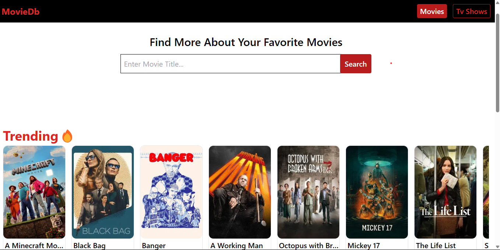
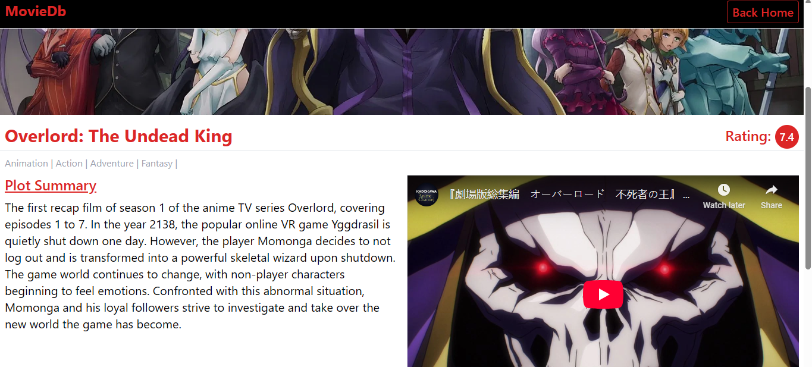
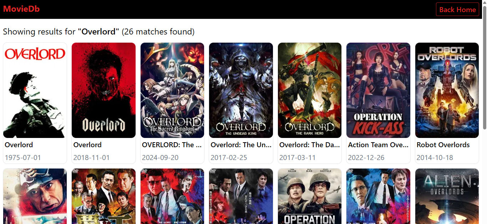

# Movie Database Application
The **Movie Database App** is a web application that allows users to explore trending, now playing, and top-rated movies and TV shows. It also allows them to search for any movie or Tv show by their title.
It fetches data from **TMDB API**.

# Features
- Trending Movies & TV Shows
- Now Playing Section
- Top Rated Section
- Movie Details Page: Displays in-depth information about selected movies or tv show including a trailer.

# Technologies Used
- **React** with **Vite**
- **Tailwind CSS** for styling
- **TMDB API** for fetching movie and tv show data
- **React Query** for efficient data fetching and caching
- **Zustand** for global state management

# Installation and Setup
Follow these steps to set up the project up and running locally: 
1. **Clone the repository:**
 ```bash
     git clone https://github.com/AustineJ101/Movie-Database-App.git
```
2. *Install Dependencies:*
 ```bash
    npm install
```
3. "Create a .env file and add your TMDB API KEY:"
 ```bash
   VITE_TMDB_API_KEY=your_api_key_here
```
4. **Start the dev server:** 
```bash
   npm run dev
```
# Deployment
This app is deployed and can be accessed at: https://movie-database-app-omega.vercel.app/

# Screenshots




# Acknowledgments 

- TMDB API for providing the movie and TV show data 
- A special thanks to **[ALX](https://www.alxafrica.com/) for providing the curriculum and support throughout this project. This Movie Database project is part of my **Capstone Project** as part of the ALX Frontend Engineering Program.

